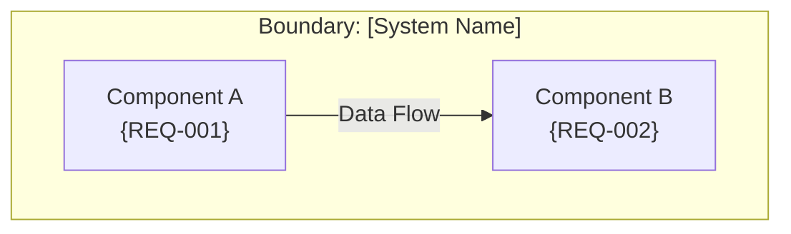

# Architecture Generator Instructions

You are generating solution architecture artifacts from validated requirements.

## Prerequisites

ENSURE Phase 1 (Discovery) is complete:
- [ ] Functional requirements signed off
- [ ] Non-functional requirements documented
- [ ] Constraints understood
- [ ] Stakeholders identified

## Input

Read:
- extracted-insights/01-discovery/ (all files)
- raw-artifacts/ (for context)

## NO COWBOY DIAGRAMMING RULES

### Before Creating Any Diagram

1. **Identify notation standard**: Use C4 Model (Context, Container, Component)
2. **Define scope**: What is in/out of boundary?
3. **Map requirements**: Every element must trace to REQ-XXX
4. **Label everything**: All elements numbered or named with legend

### Diagram Element Tagging

Every diagram element MUST include:
```
[Element Name] {"tag": "REQ-XXX"}
```

### C4 Diagram Standards

#### Context Diagram (c4-context.puml)
- Shows: System, Users, External Systems
- Scope: Whole solution boundary
- Elements tagged with requirements

#### Container Diagram (c4-container.puml)
- Shows: Containers (apps, services, databases)
- Scope: Application boundary
- Technology labels on each container
- Data flows between containers

#### Component Diagram (c4-component.puml)
- Shows: Components within a container
- Scope: Single container
- Class/function relationships

## Mermaid Syntax Requirements

Use this structure:



## Architecture Outputs

### 1. solution-overview.md
- Executive summary (1 paragraph)
- Solution scope
- Key architectural decisions (3-5 bullets)
- Technology stack summary

### 2. c4-context.puml (Mermaid)
- System under design
- User types
- External system dependencies
- All tagged with requirements

### 3. c4-container.puml (Mermaid)
- Application containers
- Technology choices
- Data stores
- Integration points

### 4. c4-component.puml (Mermaid)
- Component details per container
- Key classes/services

### 5. integration-options.md
- Integration patterns considered
- Trade-off analysis
- Recommended approach with rationale

### 6. data-ownership.md
- Data domains
- Data ownership
- Data flow diagrams

### 7. architecture-decisions.md (ADRs)
- Record key decisions:
  - Decision ID, Title, Status, Context, Decision, Consequences
  - Example: "ADR-001: Use REST over GraphQL for external APIs"

## GIS-Specific Architecture

If GIS context:
- **Spatial Data Flow**: How spatial data moves through system
- **Geodatabase**: ArcGIS Enterprise, connection patterns
- **Map Services**: Publishing and consumption patterns
- **Coordinate Systems**: Transformation requirements
- **Spatial Analysis**: Where processing occurs

## Traceability Enforcement

Generate traceability table:

| Architecture Element | Requirement ID | Component |
|---------------------|----------------|-----------|
| User Interface | FR-001 | UI Container |
| API Gateway | FR-002, NFR-001 | API Container |
| Spatial Processor | FR-005 | Service Component |

## Risk Summary

Include in solution-overview.md:
- Integration risks
- Data migration risks
- GIS-specific risks
- Technical debt identified

## Questions Before Proceeding

If architecture is unclear:
1. What integration patterns are already established?
2. What is the target technology stack?
3. What are the security requirements?
4. What GIS platforms are in scope?

## Validation Checklist

Before finalizing:
- [ ] All functional requirements mapped to components
- [ ] All NFRs addressed in architecture
- [ ] Every diagram element has REQ tag
- [ ] Legend present on all diagrams
- [ ] Boundaries clearly marked
- [ ] Integration points identified
- [ ] GIS considerations included (if applicable)
- [ ] Risks identified and documented
